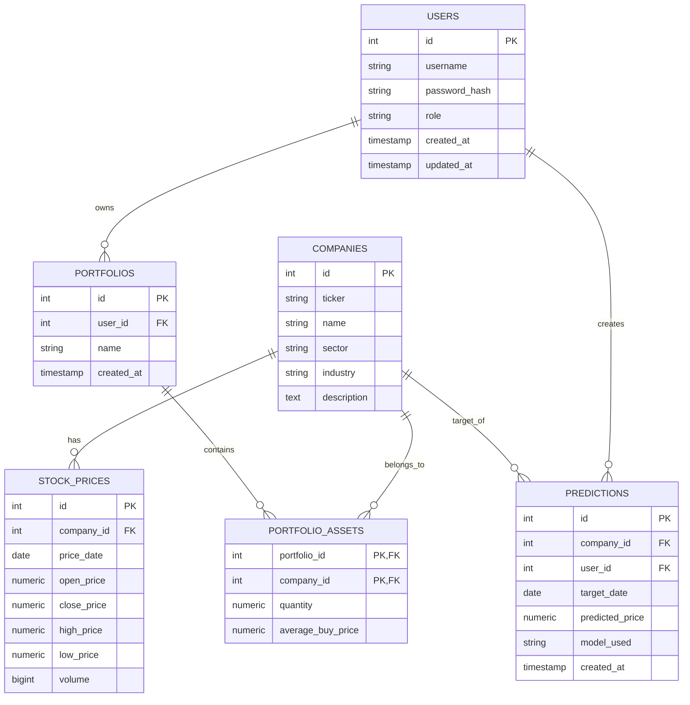

# PostgreSQL Market-Data Platform

A production-ready PostgreSQL relational database platform designed for historical stock market tracking, multi-tenant portfolio management, and algorithmic price prediction evaluation with granular role-based security.

## Why this exists

Financial market systems must satisfy strict operational requirements: storing high-volume temporal market series (daily OHLCV candles), managing personal investment portfolios across isolated user accounts, and evaluating the accuracy of predictive algorithms (e.g. LSTM, XGBoost, ARIMA). 

These systems cannot rely solely on application-level filtering to maintain data integrity and security. An accidental missing `WHERE` clause or an authorization bug in backend code can expose financial portfolios or corrupt price histories. This project exists to demonstrate how enterprise database engineering—leveraging Third Normal Form (3NF) relational modeling, database-level Row-Level Security (RLS), multi-column PL/pgSQL validation triggers, atomic transactions with explicit isolation levels (`REPEATABLE READ`), and window-function analytical views—solves these challenges directly within PostgreSQL.

## Schema

The database model is structured in Third Normal Form (3NF) to guarantee referential integrity and eliminate transitive or partial dependencies.



The database consists of 6 core tables:

1. **`users`**: Stores user authentication credentials, system roles (`admin`, `analyst`, `investor`), and automatic audit timestamps (`created_at`, `updated_at`).
2. **`companies`**: Reference directory of traded public corporations, storing unique tickers (`AAPL`, `MSFT`), full names, economic sectors, industries, and business descriptions.
3. **`stock_prices`**: Historical daily trading session records containing Open, High, Low, Close (OHLC) prices and trading volume. Enforces non-negative checks, foreign key cascades to `companies`, and a composite unique constraint `(company_id, price_date)` ensuring that no company has duplicate session data for the same day.
4. **`portfolios`**: Investment portfolios owned by users (`user_id`), allowing individual investors to group their assets across multiple accounts (e.g., retirement, growth).
5. **`portfolio_assets` (Junction Table)**: Resolves the Many-to-Many (`M:N`) relationship between `portfolios` and `companies`. 
   - *Why this junction table is required*: A single portfolio can hold stocks from multiple companies, and conversely, a single company's stock can be held simultaneously across thousands of investor portfolios. Relational normalization (1NF and 2NF) strictly forbids embedding arrays or comma-separated lists of stocks inside `portfolios`. `portfolio_assets` resolves this into two clean `1:N` relationships (`portfolios 1:N portfolio_assets` and `companies 1:N portfolio_assets`) using a composite primary key `(portfolio_id, company_id)`. Additionally, it enriches the association with position-level state: held `quantity` and the weighted `average_buy_price`.
6. **`predictions`**: Stores analytical price projections created by analysts or machine learning models (e.g., LSTM, XGBoost, ARIMA) for specific target dates, enabling forward-looking forecasting and retrospective backtesting.

## Security model

The platform enforces a Defense-in-Depth architecture combining coarse-grained Role-Based Access Control (RBAC) with fine-grained Row-Level Security (RLS).

### Role-Based Access Control (RBAC)

Defined in `database/02_roles_and_security.sql`, privileges are divided across three database roles:

| Role | Intended Actor | Privileges & Restrictions |
| :--- | :--- | :--- |
| **`db_admin`** | Database / Platform Administrator | Full super-access: `ALL PRIVILEGES` on all tables and sequences in the `public` schema. Can execute administrative DDL, manage users, and audit platform operations. |
| **`db_analyst`** | Financial Analyst / ML Pipeline | `SELECT` on all tables in `public`. `INSERT` and `UPDATE` access to market data (`stock_prices`, `companies`, `predictions`) and sequences. Explicitly restricted from modifying user accounts, passwords, or investor portfolios. |
| **`db_investor`** | Retail Investor Client | Read-only `SELECT` access on public market data (`companies`, `stock_prices`, `predictions`). Full CRUD (`SELECT`, `INSERT`, `UPDATE`, `DELETE`) on portfolios and positions (`portfolios`, `portfolio_assets`), with sequence access for `portfolios_id_seq`. Cannot tamper with market feeds or system entities. |

### Row-Level Security (RLS) Deep-Dive

Standard table-level permissions are insufficient for multi-tenant applications: granting `SELECT, INSERT, UPDATE, DELETE` on `portfolios` to `db_investor` would allow an investor to view and modify every other investor's portfolio. 

To eliminate this vulnerability at the storage engine level, Row-Level Security is explicitly enabled on both tenant-facing tables:

```sql
ALTER TABLE portfolios ENABLE ROW LEVEL SECURITY;
ALTER TABLE portfolio_assets ENABLE ROW LEVEL SECURITY;
```

Once RLS is enabled on a table, PostgreSQL activates a **default-deny** model: all rows become invisible to non-superusers unless an explicit policy permits access.

#### 1. Administrator Full-Bypass Policies
Administrators require unrestricted visibility across all accounts for audits and maintenance:

```sql
CREATE POLICY admin_all_portfolios ON portfolios TO db_admin USING (true) WITH CHECK (true);
CREATE POLICY admin_all_assets ON portfolio_assets TO db_admin USING (true) WITH CHECK (true);
```
- `USING (true)`: Guarantees that `SELECT`, `UPDATE`, and `DELETE` queries match all rows.
- `WITH CHECK (true)`: Allows `INSERT` and `UPDATE` operations without constraint restrictions.

#### 2. Investor Tenant-Isolation Policies
In modern cloud architectures using connection pools, applications connect as a shared database role (`db_investor`) and establish user context dynamically per request or transaction via `SET LOCAL app.current_user_id = '<user_id>'`:

```sql
CREATE POLICY investor_own_portfolios ON portfolios TO db_investor
    USING (user_id = NULLIF(current_setting('app.current_user_id', true), '')::int)
    WITH CHECK (user_id = NULLIF(current_setting('app.current_user_id', true), '')::int);

CREATE POLICY investor_own_assets ON portfolio_assets TO db_investor
    USING (portfolio_id IN (
        SELECT id FROM portfolios 
        WHERE user_id = NULLIF(current_setting('app.current_user_id', true), '')::int
    ))
    WITH CHECK (portfolio_id IN (
        SELECT id FROM portfolios 
        WHERE user_id = NULLIF(current_setting('app.current_user_id', true), '')::int
    ));
```

- **Read Isolation (`USING`)**: When an investor executes `SELECT * FROM portfolios`, PostgreSQL rewrites the query internally to append the policy condition. The user physically cannot view rows belonging to other investors.
- **Write Validation (`WITH CHECK`)**: During `INSERT` or `UPDATE`, the engine verifies that the target `user_id` matches the session context. Attempting to insert a portfolio or asset under a foreign `user_id` throws a security violation.
- **Transitive Ownership on Assets**: Because `portfolio_assets` does not directly store `user_id`, ownership is verified transitively via a subquery on `portfolios`. An investor can only see or modify asset rows whose parent `portfolio_id` is registered to their user ID.

This architecture ensures zero-trust tenancy: even if backend API code omits a `WHERE user_id = ?` clause, PostgreSQL prevents data leakage.

## Integrity and triggers

In addition to declarative schema constraints (e.g. `CHECK (quantity >= 0)`, foreign keys with cascading deletions), business invariants are enforced via PL/pgSQL triggers in `database/04_functions_and_triggers.sql`:

### 1. `update_modified_column()`
- **Trigger**: `update_users_modtime BEFORE UPDATE ON users FOR EACH ROW`
- **Validation**: Automatically sets `NEW.updated_at = NOW();` before saving modifications to the `users` table. This guarantees that audit timestamps remain accurate without relying on client-side application code.

### 2. `check_stock_prices_validity()`
- **Trigger**: `trg_check_stock_prices BEFORE INSERT OR UPDATE ON stock_prices FOR EACH ROW`
- **Validation**: Enforces strict financial rules on daily OHLC candlestick pricing:
  1. **High/Low sanity**: `NEW.high_price >= NEW.low_price`. Prevents corrupted sessions where the day's high is recorded as lower than the day's low (`RAISE EXCEPTION 'High nie moze byc mniejsze od low'`).
  2. **Open price bounding**: `NEW.open_price <= NEW.high_price AND NEW.open_price >= NEW.low_price`. Guarantees that opening prices fall within the day's trading range (`RAISE EXCEPTION 'Cena otwarcia poza widelkami'`).
  3. **Close price bounding**: `NEW.close_price <= NEW.high_price AND NEW.close_price >= NEW.low_price`. Guarantees that closing prices fall within the day's trading range (`RAISE EXCEPTION 'Cena zamkniecia poza widelkami'`).

These automated checks prevent faulty external market data feeds from contaminating analytical pipelines.

## Transactions

The script `database/05_transactions.sql` demonstrates ACID compliance and transaction isolation control:

### Isolation Level: `REPEATABLE READ`
The script showcases financial reporting under an explicit transaction isolation level:

```sql
BEGIN TRANSACTION ISOLATION LEVEL REPEATABLE READ;
SELECT sum(quantity * average_buy_price) FROM portfolio_assets WHERE portfolio_id = 1;
COMMIT;
```

**Why this level and what it guarantees**:
PostgreSQL's `REPEATABLE READ` isolation level guarantees that all queries within a transaction see a consistent snapshot of data taken at the transaction's first query, completely preventing dirty reads, non-repeatable reads, and phantom reads. In financial portfolio valuation and market reporting, this ensures that aggregations and balance calculations do not read half-committed trades or skewed numbers while concurrent transactions are actively inserting or modifying asset positions.

### Atomic Weighted Average Upsert
When purchasing additional shares of an already-held asset, the platform calculates a weighted average purchase price atomically using PostgreSQL's `ON CONFLICT` clause:

```sql
BEGIN;
INSERT INTO portfolio_assets (portfolio_id, company_id, quantity, average_buy_price)
VALUES (1, 2, 100, 145.50)
ON CONFLICT (portfolio_id, company_id) DO UPDATE SET
    average_buy_price = ((portfolio_assets.quantity * portfolio_assets.average_buy_price) + (100 * 145.50)) / (portfolio_assets.quantity + 100),
    quantity = portfolio_assets.quantity + 100;
COMMIT;
```

### Atomic Constraint Rollback
When an invalid operation is detected (such as attempting to insert a negative quantity `-50`, violating `CHECK (quantity >= 0)`), the transaction is cleanly aborted using `ROLLBACK`, leaving the portfolio state untainted.

## Views

Predefined views in `database/03_views_and_queries.sql` simplify complex analytical queries and eliminate redundant client-side calculations:

### 1. `v_latest_prices`
- **Purpose**: Solves the classic "latest price per stock" problem without executing slow, repetitive correlated subqueries.
- **Implementation**: Uses the window function `ROW_NUMBER() OVER(PARTITION BY company_id ORDER BY price_date DESC) as rn` inside a Common Table Expression (CTE), filtering on `rn = 1` and joining with `companies`. Provides client applications with an immediate snapshot of current market prices for every ticker.

### 2. `v_predictions_vs_actuals`
- **Purpose**: Serves as a backtesting and model accuracy evaluation engine.
- **Implementation**: Joins `predictions` with `companies` and executes a `LEFT JOIN stock_prices` on matching `target_date = price_date`. Calculates the absolute percentage error:
  $$\text{Error (\%)} = \frac{|\text{predicted\_price} - \text{actual\_price}|}{\text{actual\_price}} \times 100$$
  This allows quantitative analysts to benchmark predictive models (e.g., LSTM vs. XGBoost vs. ARIMA) against real-world price movements.

## Running it

To deploy the schema, configure roles, load triggers, and seed sample data, execute the numbered scripts via `psql` in the following sequence:

### Prerequisites
Ensure PostgreSQL is running and create the target database:
```bash
createdb -U postgres stock_db
```

### Script Execution Order

```bash
# 1. Create schema (tables, foreign keys, table-level check constraints, basic indexes)
psql -U postgres -d stock_db -f database/01_schema.sql

# 2. Configure roles, permissions, and Row-Level Security
# Passwords must be supplied dynamically via psql variables (-v):
psql -U postgres -d stock_db \
  -v admin_password='YourAdminPasswordHere123!' \
  -v analyst_password='YourAnalystPasswordHere123!' \
  -v investor_password='YourInvestorPasswordHere123!' \
  -f database/02_roles_and_security.sql

# 3. Load PL/pgSQL validation functions and business logic triggers
psql -U postgres -d stock_db -f database/04_functions_and_triggers.sql

# 4. Create analytical views and reporting queries
psql -U postgres -d stock_db -f database/03_views_and_queries.sql

# 5. Populate sample test data (users, companies, prices, portfolios, predictions)
psql -U postgres -d stock_db -f database/06_sample_data.sql

# 6. (Optional) Run transaction and isolation demonstration scripts
psql -U postgres -d stock_db -f database/05_transactions.sql
```

## Team and my contribution

This repository was developed as a collaborative three-person university database project:

- **Miłosz Gibała** (Lead Author & Core Architect): Authored the initial repository architecture and the core substantive implementation (initial commit `6826593`, 9 files, +330 lines):
  - Complete 3NF relational schema design (`01_schema.sql`).
  - Role-based security model, privilege grants, and Row-Level Security policies (`02_roles_and_security.sql`).
  - Analytical database views (`03_views_and_queries.sql`).
  - Stored PL/pgSQL functions and data validation triggers (`04_functions_and_triggers.sql`).
  - Transaction routines with custom isolation levels and UPSERT logic (`05_transactions.sql`).
  - Demonstration seed data and baseline documentation (`06_sample_data.sql`).
- **wiedzmok**: Implemented the `calculate_portfolio_value` PL/pgSQL function (+15 lines).
- **MichalWnek**: Implemented the `v_sector_performance` window function view and contributed to documentation redaction (+7 lines).

## What I'd do differently

Reflecting on the implementation against production engineering standards, here are 3 technical improvements for future iterations:

1. **Composite and Foreign-Key Indexing Strategy**: 
   While basic single-column indexes exist (`idx_stock_prices_date`, `idx_companies_sector`, `idx_predictions_target_date`), the schema lacks indexes aligned with the most frequent query patterns. In `stock_prices`, queries in `v_latest_prices` and historical date range lookups filter by company and sort by date descending; a composite B-tree index on `(company_id, price_date DESC)` would enable high-performance index-only scans. Furthermore, foreign key columns such as `portfolios(user_id)` and `predictions(company_id, user_id)` lack dedicated indexes; in PostgreSQL, foreign keys do not create indexes automatically, leading to sequential scans during foreign key checks, cascading deletes, and RLS subquery lookups.
2. **Secrets Management Decoupled from DDL**:
   Although passwords were moved to `psql` variables (`:'admin_password'`), passing credentials via command-line arguments (`-v`) can expose secrets in process tables (`ps aux`) or shell history files (`.bash_history`). In a production architecture, role authentication should be decoupled from SQL scripts entirely using secret managers (e.g. HashiCorp Vault, AWS Secrets Manager), certificate-based authentication (mTLS / `pg_ident`), or IAM identity federation.
3. **Versioned Database Migrations (Flyway / Liquibase / Alembic)**:
   The database currently uses manually ordered SQL files with destructive `DROP TABLE ... CASCADE` statements. While suitable for rapid local prototyping, this approach cannot be used in production environments where schema changes must be applied non-destructively to existing data. Future versions should adopt a formal database migration tool (such as Flyway, Liquibase, or Alembic) to provide versioned, immutable forward migrations, checksum validation, and automated rollbacks.
