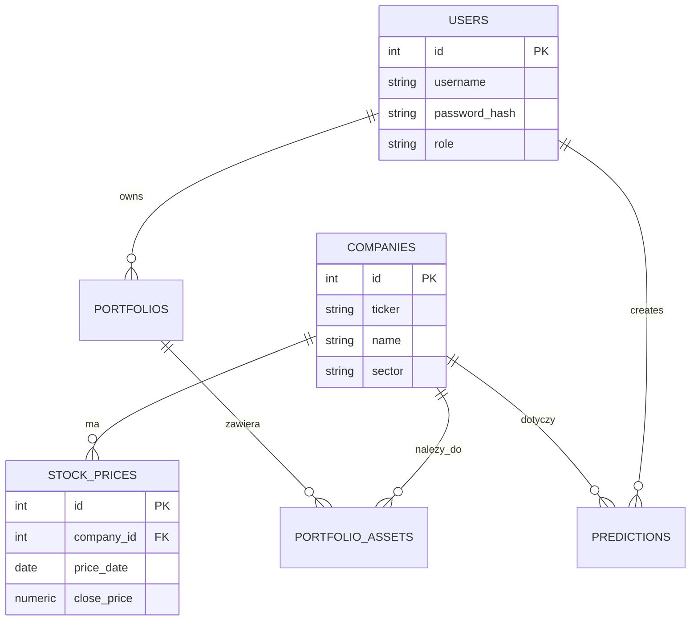

# Dokumentacja bazy danych: Giełda

## O co chodzi
Projekt do zapisywania danych giełdowych, portfeli inwestycyjnych i przewidywań analityków. Wybraliśmy PostgreSQL, bo ma fajne funkcje okna i łatwo się pisze triggery.

## Baza i tabele
Zrobiliśmy to w 3NF, żeby uniknąć powtórzeń. Mamy tabele na uzytkownikow, spółki, historie notowań (ceny dzienne), portfele, sklad tych portfeli (wiele do wielu wiec tabela laczaca) i na prognozy analitykow.

## Schemat (ERD)

*(uproszczony dla czytelności)*

## Zaawansowane rzeczy na ocenę
*   **Transakcje**: zrobiony skrypt z pokazaniem commit, rollback, upserta oraz izolacją repeatable read.
*   **Role**: dodani uzytkownicy z różnymi prawami (`admin`, `analyst`, `investor`).
*   **Widoki**: zrobiony np. podgląd, czy prognoza się sprawdziła łącząc to z historią, subselecty do liczenia średniej itp.
*   **Wyzwalacze (Triggers)**: napisana w plpgsql walidacja, czy cena high jest rzeczywiście największa danego dnia.

## Instrukcja
Żeby odpalić lokalnie w psql:
1. `\i 01_schema.sql`
2. `\i 02_roles_and_security.sql`
3. `\i 03_views_and_queries.sql`
4. `\i 04_functions_and_triggers.sql`
5. `\i 06_sample_data.sql`
