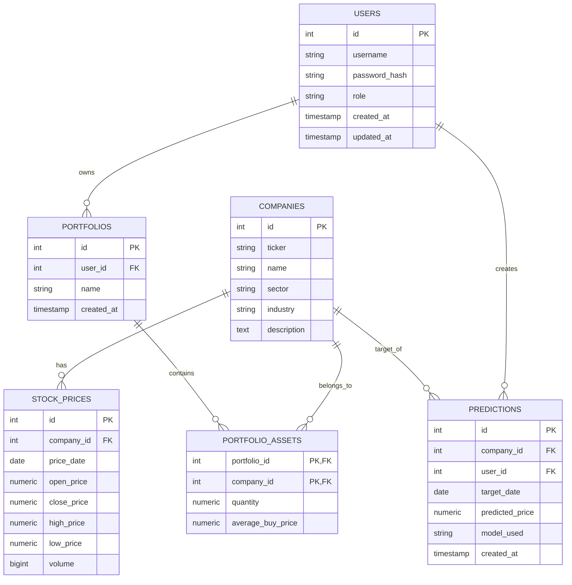

> **Note**: This is the original project documentation written in Polish. For the comprehensive English documentation and system architecture guide, please refer to the [README.md](../README.md).

# Dokumentacja Projektowa Bazy Danych
**Temat**: Analiza i prognozowanie trendów giełdowych na podstawie danych historycznych
**System Zarządzania Bazą Danych**: PostgreSQL

## 1. Cel i Wymagania Systemu
System służy do magazynowania notowań historycznych spółek giełdowych, zarządzania portfelami inwestycyjnymi użytkowników oraz przechowywania predykcji przyszłych cen utworzonych przez algorytmy/analityków.

System umożliwia:
- Zbieranie i przechowywanie informacji o spółkach giełdowych (ticker, sektor itp.).
- Rejestrowanie dziennych notowań giełdowych (ceny otwarcia, zamknięcia, max, min, wolumen).
- Zarządzanie użytkownikami (role: `admin`, `analyst`, `investor`).
- Przechowywanie prognoz stworzonych na podstawie różnego typu modeli analitycznych.
- Śledzenie zawartości portfeli inwestycyjnych (aktywów per portfel i użytkownik).

## 2. Diagram Związków Encji (ERD)

## 3. Zgodność z postaciami normalnymi
Baza jest zgodna z Trzecią Postacią Normalną (3NF):
- **1NF**: Tabele są płaskie (np. `portfolio_assets` ma własne rekordy dla każdego aktywa, brak wielowartościowych atrybutów).
- **2NF**: Każda tabela posiada zdefiniowany unikalny klucz główny (PK), na którym w pełni zależą atrybuty niekluczowe. W przypadku złożonego klucza w `portfolio_assets` oba atrybuty determinują ilość i średnią cenę zakupu.
- **3NF**: Brak przechodnich zależności. Na przykład informacje o spółce (nazwa, sektor) nie są powielane w `stock_prices`, tylko odizolowane do encji `companies`.

## 4. Wykorzystanie zaawansowanych mechanizmów 

### 4.1. Transakcje i Izolacja
Użyto mechanizmów chroniących przed brakiem spójności (np. zakup nowych akcji powiększa istniejące pakiety poprzez logikę UPSERT / ON CONFLICT).
System udostępnia przykład użycia poziomu izolacji `REPEATABLE READ`, używanego do tworzenia zablokowanych widoków podczas analityki (skrypt `05_transactions.sql`).

### 4.2. Bezpieczeństwo i Role
Stworzono wyodrębnione role bazodanowe dla każdego typu aktora w systemie (`db_admin`, `db_analyst`, `db_investor`). Inwestor widzi tylko dane publiczne i swoje portfele (skrypt `02_roles_and_security.sql`).

### 4.3. Widoki i Zagnieżdżenia (DQL)
Zaimplementowano dedykowane widoki do łatwej konsumpcji danych, w tym np. podzapytanie zestawiające faktyczną realizację prognoz w przeszłości z pierwotnym zgłoszeniem `v_predictions_vs_actuals` (skrypt `03_views_and_queries.sql`).

### 4.4. Język proceduralny i Wyzwalacze (Triggers)
Plik `04_functions_and_triggers.sql` zawiera logikę biznesową pisaną z użyciem `PL/pgSQL`, weryfikującą na bieżąco, czy ceny historyczne nie zaprzeczają same sobie (np. czy cena MIN nie jest wyższa od MAX).

## 5. Podział Pracy Zespołowej
Zgodnie z wymaganiami, struktura bazy została postawiona wspólnie, a konkretne zaawansowane skrypty przypisano poszczególnym osobom:
- **Kolega 1**: Implementacja funkcji proceduralnej w `TODO_kolega_1.sql` podsumowującej realny aktualny bilans finansowy portfela.
- **Kolega 2**: Utworzenie wysoce skomplikowanego zapytania w `TODO_kolega_2.sql` w formie widoku, który wykorzystuje zapytania Okienkowe (Window Functions) do wyliczenia relacji wzrostów firm względem ich własnego sektora.

## 6. Uruchomienie Bazy - Instrukcja krok po kroku
Aby uruchomić ten projekt bazy w środowisku PostgreSQL, postępuj w poniższej kolejności:
1. Skrypt definiujący bazę i relacje: `psql -U postgres -d stock_db -f 01_schema.sql`
2. Konfiguracja ról i uprawnień: `psql -U postgres -d stock_db -f 02_roles_and_security.sql`
3. Załadowanie procedur wyzwalaczy: `psql -U postgres -d stock_db -f 04_functions_and_triggers.sql`
4. Przygotowanie widoków SQL: `psql -U postgres -d stock_db -f 03_views_and_queries.sql`
5. Dane startowe/demonstracyjne: `psql -U postgres -d stock_db -f 06_sample_data.sql`
6. Opcjonalne skrypty zapytań i transakcji (pokazowe): `05_transactions.sql`

Koledzy w ramach swojego commita powinni odpalić analogicznie poleceniem psql swoje pliki po skończeniu pracy.
